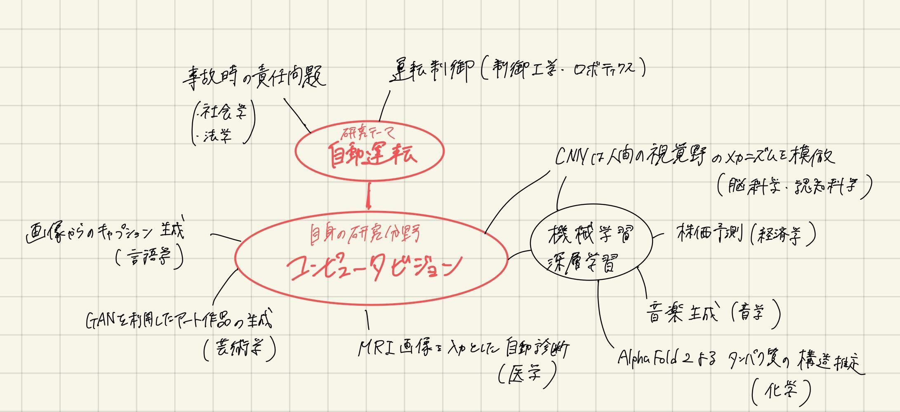

# 情報学の展望

    学籍番号: 6930348393 &nbsp; &nbsp; 氏名: 木下 元希

 

## 1. 情報学とはどのような学問か，自身の視点から展望せよ．

情報学とは，各学問分野を新たにつなぎ合わせるかけ橋となる学問であり，各分野と結びつくことにより大きな意味を成す分野である．情報学が発展するにしたがい，人々の生活をより便利で円滑になっていく．
</img>

 

## 2. 新型コロナウイルス感染症により世界中で様々な問題が生じているが，その解決に，情報学が貢献できることを考えよ．

新型コロナウイルスは感染力が非常に強いことから，医療現場において医師や看護師たちは防護服を身に着けて検診・看護を行うように取り組みがなされている．しかし，そのような対策を行った場合でも，医療従事者への感染リスクは依然として残っている．また感染症患者にとって，防護服に見を包んだ顔もわからない人から看病されることは，不安感を増長させてしまう可能性も大いにあり得る．</>実際に処置が必要な場合を除き，検診のみの場合などには，ICT を活用し，テレビ電話での対応を行うよう設備を整えることにより，この状況は改善できる．患者と直接対面する機会を減らすことにより，医療従事者の感染リスクを下げ，相手の顔を見ながら検診を行うことで，患者側も落ち着いて医師とコミュニケーションをとることが可能となる．ただし，お年寄りなどの IT リテラシーの低い層にとって，PC をつけてテレビ電話で対応することは難しい．そのため IT リテラシーの有無に関わらず利用しやすいインターフェースの機器が必要となることが課題として挙げられる．
